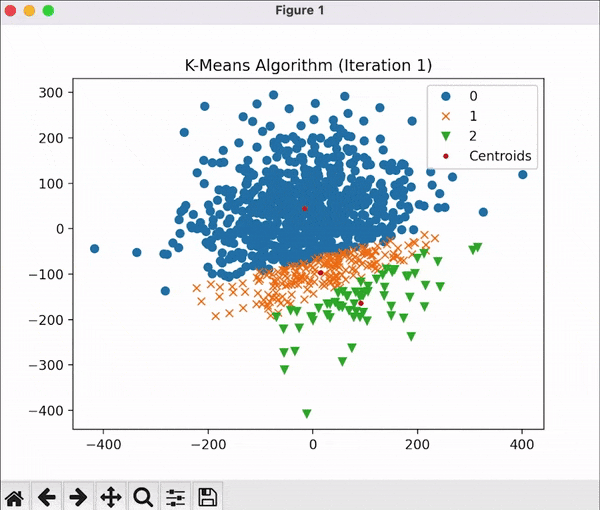

<h1 align="center">K-Means Clustering</h1>

<div align="center" >
  
</div>
The above shows K-Means Clustering of 1000 randomly sampled points with k=3. Each point & the initial centroid are sampled from a normal distribution of X~N(0, 100*100). The points are iteratively reassigned to the cluster of the nearest centroid; The coordinates of the centroids are then calculated using the average of all it's members after each iteration.


## Usage
1. Installing packages
    ```sh
    pip install -r requirements.txt
    ```
2. Launching visualization
    ```py
    python visualize.py
    ```

## Contact
Chau Yuan Qi - [@chauyuanqi](https://twitter.com/chauyuanqi) - yuanqichau@gmail.com
